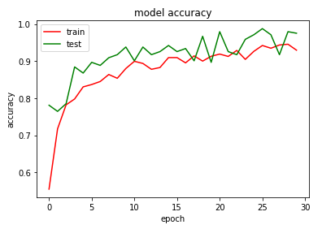
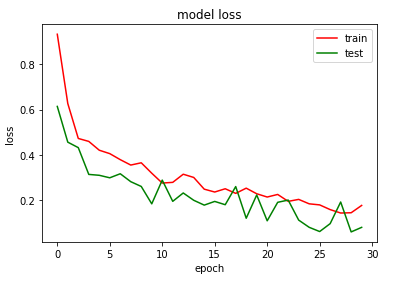

# Covid19-and-Pneumonia-Diseases-Detection-and-Deployment-using-Flask
>**I have created a Deep Learning CNN model which enables us classifying a given chest X-ray image into Covid-19, Pneumonia or Normal.**

Here I have, trained a CNN model on nearly 1800 Chest X-ray images from different Categories like Covid-19, Pneumonia and Normal. Further I saved the trained model and used Flask for creating the REST API. After creation of REST API we would be able to use the web app which ultimately will be running in our-local PC which enables us classifying a given chest X ray image into Covid-19, Pneumonia and Normal. In the end accuracy of our Deep Learning for test and training set was nearly 95 percent.

 
